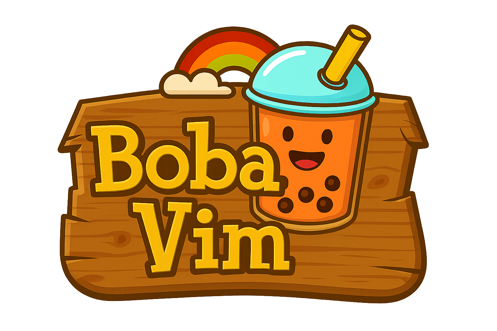

# 🧋 Boba.vim - Open Source

A multiplayer Vim game built with Go and vanilla JavaScript, teaching Vim commands through interactive gameplay.



## 🚀 Quick Start

### Prerequisites
- Go 1.19 or higher
- Git

### Installation

1. **Clone the repository**
   ```bash
   git clone https://github.com/Flotapponnier/Open-source-Bobavim.git
   cd Open-source-Bobavim
   ```

2. **Set up environment**
   ```bash
   make setup
   ```
   This will create a `.env` file from `.env.example`. Edit `.env` if you need custom settings.

3. **Start the development server**
   ```bash
   make dev
   # or simply: go run main.go
   ```

4. **Open your browser**
   - Game: http://localhost:8080
   - Admin Panel: http://localhost:8080/dashboard/secure/admin (username: `test`, password: `test`)

## 🎮 How to Play

1. **Choose your character** - Select from various boba-themed sprites
2. **Select a map** - Pick from different difficulty levels
3. **Navigate using Vim commands** - Use `h`, `j`, `k`, `l`, `w`, `b`, `0`, `$`, etc.
4. **Collect pearls** - Reach pearls to score points
5. **Complete the map** - Get to the mold before time runs out!

### Game Modes
- **Solo Play**: Practice Vim commands at your own pace
- **Multiplayer**: Compete with other players in real-time
- **Tutorial**: Learn basic Vim movements step-by-step

## 🛠 Development

### Available Commands

```bash
make help          # Show all available commands
make setup         # Initial setup
make dev           # Start development server
make build         # Build the application
make test          # Run tests
make lint          # Run linter
make clean         # Clean build artifacts
make start         # Quick start (setup + dev)
```

### Project Structure

```
├── internal/           # Go backend code
│   ├── handlers/      # HTTP request handlers
│   ├── services/      # Business logic
│   ├── models/        # Data models
│   └── game/          # Game logic and multiplayer
├── static/            # Frontend assets
│   ├── css/          # Stylesheets
│   ├── js/           # JavaScript modules
│   ├── sprites/      # Game sprites and images
│   └── music/        # Audio files
├── templates/         # HTML templates
└── main.go           # Application entry point
```

## 🔧 Configuration

### Environment Variables

Key settings in `.env`:

```bash
PORT=8080                    # Server port
ENV=development             # Environment (development/production)
DATABASE_URL=boba_vim.db    # SQLite database file
ADMIN_USERNAME=test         # Admin panel username
ADMIN_PASSWORD=test         # Admin panel password

# Game Settings
PEARL_POINTS=100           # Points per pearl
TARGET_SCORE=500           # Score needed to win
MAX_GAME_TIME=480          # Game time limit (seconds)

# Optional: Email service (for password reset)
RESEND_API_KEY=your-key-here
FROM_EMAIL=noreply@yourdomain.com
```

### Database

The game uses SQLite by default for local development. The database is automatically created on first run with:
- Admin account (test/test)
- Sample maps and game data
- User progress tracking

## 🎯 Features

### Core Gameplay
- **Vim Movement Training**: Practice `h`, `j`, `k`, `l`, `w`, `b`, `e`, `0`, `$`, `gg`, `G`, and more
- **Progressive Difficulty**: Maps designed to teach specific Vim concepts
- **Real-time Scoring**: Points based on movement efficiency
- **Time Challenges**: Complete maps within time limits

### Multiplayer
- **Real-time Competition**: Race against other players
- **WebSocket Communication**: Low-latency multiplayer experience
- **Live Leaderboards**: See who's the fastest Vim navigator
- **Spectator Mode**: Watch other players compete

### Character System
- **Multiple Characters**: Choose from various boba-themed sprites
- **Character Progression**: Unlock new characters by completing maps
- **Avatar System**: Profile pictures and customization

### Technical Features
- **Responsive Design**: Works on desktop and mobile
- **Modular Architecture**: Clean separation of concerns
- **Performance Optimized**: Efficient game state management
- **Accessibility**: Keyboard-first navigation

## 💡 Ideas to Improve the Game

### Map Creation System
- **Player Map Editor**: Develop a map creation system using insert mode, allowing players to design custom maps
- **Community Maps**: Share and download maps created by other players
- **Map Validation**: Ensure created maps are solvable and follow game mechanics

### Social Features
- **Friend List System**: Implement a friend list where players can connect and challenge each other
- **Multiplayer Challenges**: Allow friends to propose fights and competitions
- **Player Profiles**: Enhanced profile system with statistics and achievements

### Game System Enhancements
- **New Game Modes**: Develop additional gaming systems and mechanics
- **Extended Command Set**: Include more advanced Vim commands and movements
- **Progressive Learning**: Structured learning paths for different skill levels
- **Achievement System**: Unlock rewards and recognition for mastering commands

### Technical Improvements
- **Framework Migration**: Migrate from vanilla HTML/JS/CSS to a modern framework (React, Vue, or Svelte)
- **Enhanced UI/UX**: Improve user interface and user experience components
- **Mobile Optimization**: Better mobile responsiveness and touch controls
- **Performance Optimization**: Optimize game performance and loading times

### Additional Features
- **Themes and Customization**: Multiple visual themes and UI customization options
- **Sound Design**: Enhanced audio feedback and background music
- **Accessibility**: Improved accessibility features for diverse user needs
- **Analytics**: Game analytics to understand player behavior and improve gameplay

## 🤝 Contributing

We welcome contributions! Here's how to get started:

1. **Fork the repository**
   ```bash
   git fork https://github.com/Flotapponnier/Open-source-Bobavim.git
   ```

2. **Create a feature branch**
   ```bash
   git checkout -b feature/amazing-feature
   ```

3. **Make your changes and test**
   ```bash
   make test
   make lint
   ```

4. **Submit a pull request**

### Development Guidelines
- Follow Go best practices and conventions
- Write tests for new features
- Keep JavaScript modular and well-documented
- Test multiplayer functionality thoroughly
- Maintain backwards compatibility

## 📖 Game Design

### Maps
Maps are designed around specific Vim concepts:
- **Beginner**: Basic `h`, `j`, `k`, `l` movement
- **Word Movement**: `w`, `b`, `e` commands
- **Line Navigation**: `0`, `$`, `^` commands
- **Advanced**: `f`, `t`, `/`, `?` search commands

### Scoring System
- **Movement Efficiency**: Fewer keystrokes = higher score
- **Time Bonus**: Complete maps quickly for bonus points
- **Combo System**: Chain movements for multiplier bonuses

## 🔗 Links

- **Repository**: https://github.com/Flotapponnier/Open-source-Bobavim
- **Issues**: https://github.com/Flotapponnier/Open-source-Bobavim/issues
- **Discussions**: https://github.com/Flotapponnier/Open-source-Bobavim/discussions

## 📄 License

This project is open source. Feel free to use, modify, and distribute according to the license terms.

## 🙏 Acknowledgments

- Built with ❤️ for the Vim community
- Inspired by Vim's elegant movement philosophy
- Thanks to all contributors and players!

---

**Happy Vimming!** 🧋✨